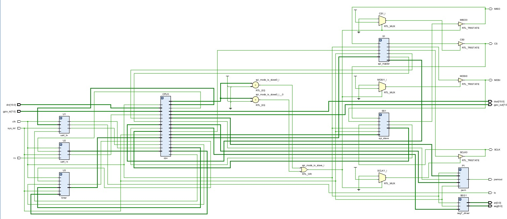
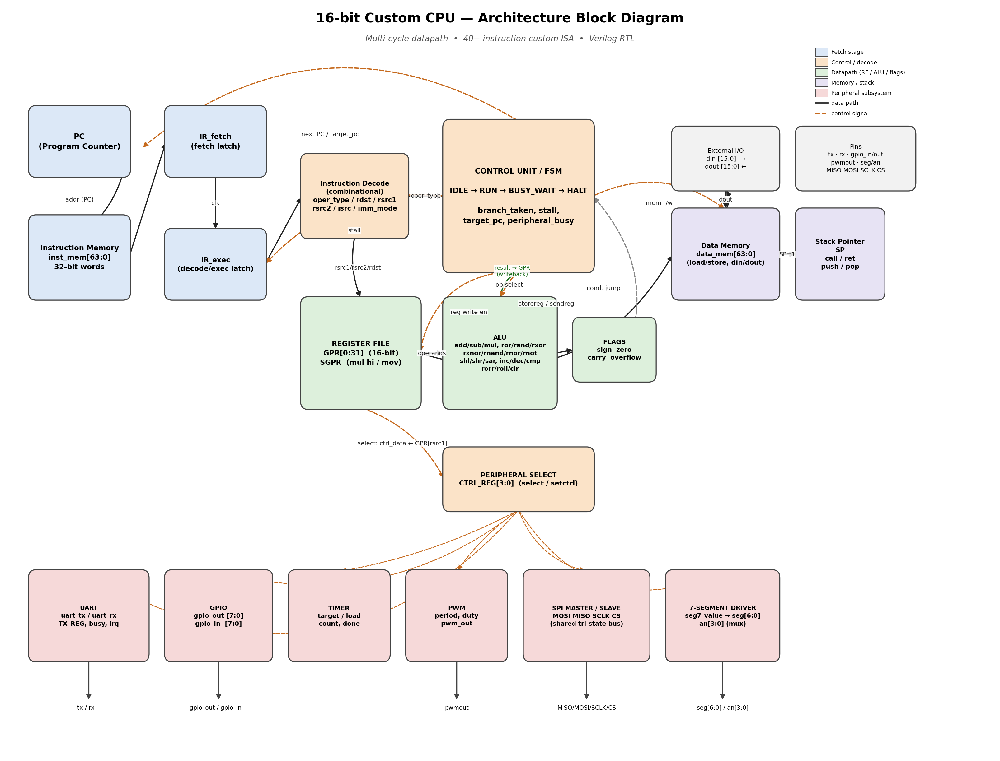
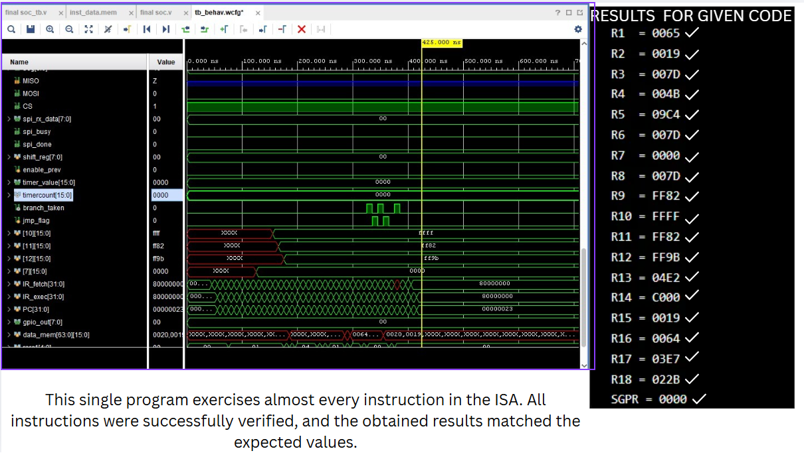
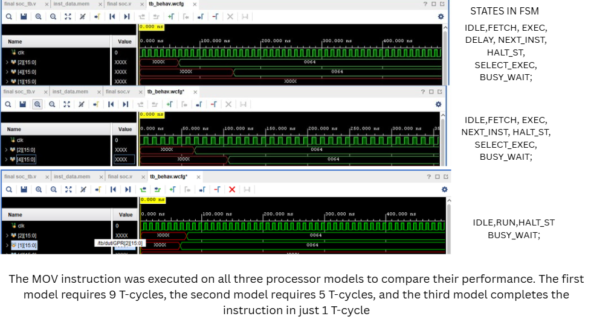
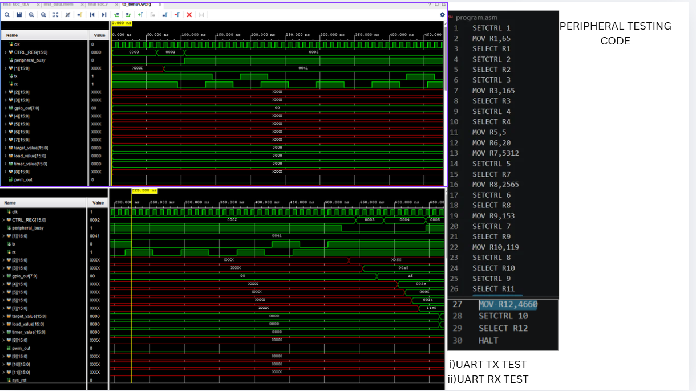
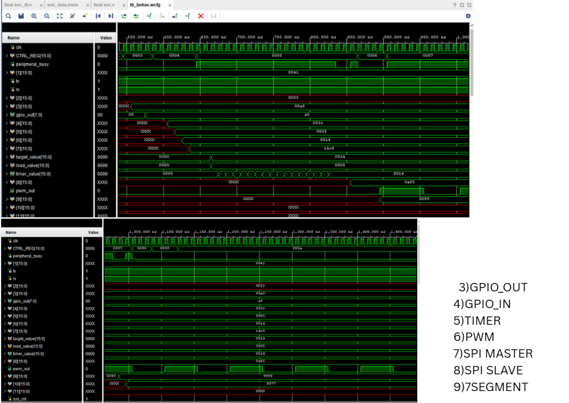

# PHOENIX-16
### A Custom 16-bit Processor Core with Integrated Peripheral Subsystem
## 1. Overview

PHOENIX-16 is a 16-bit processor core designed and implemented from the ground up in Verilog RTL — a custom instruction set, a custom 32-bit instruction encoding, a custom multi-cycle control unit, and a fully self-contained peripheral ecosystem, with no dependency on an existing ISA template. The core was built, debugged, and optimized across several design iterations, evolving from a slow multi-T-cycle execution model into a fast near-single-cycle datapath.

**Core specifications**

| Feature                              |                   Detail                                        |
|--------------------------------------|-----------------------------------------------------------------|
| Data width                           | 16-bit                                                          |
| Instruction width                    | 32-bit                                                          |
| Opcode field                         | 6-bit (64 instructions max)                                     |
| General-purpose registers            | 32 × 16-bit (GPR[0:31]) + special register SGPR                 |
| Addressing modes                     | Register–Register and Register–Immediate                        |
| Control style                        | FSM-based, multi-cycle                                          |
| Peripherals                          | UART, GPIO, Timer, PWM, SPI (Master + Slave), 7-Segment Display |
| Stack                                | Hardware Stack Pointer (SP) for `call` / `ret` / `push` / `pop` |

## 2. Toolchain & Workflow

Before touching the RTL, programs for PHOENIX-16 are written in **assembly**, using the project's own mnemonics (`mov`, `add`, `setctrl`, `select`, `jump`, `call`, …). A custom **assembler** translates this assembly source into 32-bit machine code, which is then loaded into the CPU's instruction memory and simulated on the Verilog core.

```
   ┌────────────┐      ┌──────────────┐      ┌──────────────────┐      ┌───────────────┐
   │  ASM code  │ ───▶ │  Assembler   │ ───▶ │  inst_data.mem  │ ───▶ │  Verilog RTL │
   │ (.asm)     │      │ (mnemonic →  │      │  (binary/hex,    │      │  simulation / │
   │            │      │  32-bit word)│      │  $readmemb load) │      │  FPGA run     │
   └────────────┘      └──────────────┘      └──────────────────┘      └───────────────┘
```

1. Write the program in assembly.
2. Run it through the assembler to generate the binary instruction stream.
3. The CPU's `initial $readmemb("inst_data.mem", inst_mem);` loads the program into instruction memory.
4. Simulate and observe register, memory, and peripheral behavior 

---

## 3. Architecture Block Diagram


The core is organized into five major sections:

- **Fetch Stage** — Program Counter (PC), Instruction Memory, and the `IR_fetch` → `IR_exec` pipeline latches.
- **Control Unit (FSM)** — decodes `oper_type` every cycle and drives the entire datapath: ALU operation select, register-file write enable, memory read/write, branch resolution, and peripheral dispatch.
- **Register File** — 32 × 16-bit GPRs plus SGPR (used for the upper half of `mul` results and `movsgpr`).
- **ALU** — executes all arithmetic, logical, and shift/rotate operations and produces the status flags.
- **Peripheral Subsystem** — UART, GPIO, Timer, PWM, SPI Master/Slave, and the 7-segment driver, all addressed through a single peripheral-select mechanism.

---

## 4. ALU Instructions & Control Logic

### 4.1 Instruction format

Each instruction is a 32-bit word. Bit 0 (`imm_mode`) selects the addressing mode:

- **`imm_mode = 0`** (Register–Register): `[31:26] opcode | [25:21] rdst | [20:16] rsrc1 | [15:11] rsrc2`
- **`imm_mode = 1`** (Register–Immediate): `[31:26] opcode | [25:22] rdst | [21:17] rsrc1 | [16:1] immediate`

### 4.2 operation groups
| Category              | Instructions                                                  |
|-----------------------|---------------------------------------------------------------|
| Arithmetic            | `ADD`, `SUB`, `MUL`, `INC`, `DEC`                             |
| Logical               | `RAND`, `ROR`, `RXOR`, `RXNOR`, `RNAND`, `RNOR`, `RNOT`       |
| Shift / Rotate        | `SHL`, `SHR`, `SAR`, `RORR`, `ROLL`                           |
| Compare / Misc        | `CMP`, `CLR`, `MOV`, `MOVSGPR`                                |
| Storage               | `STOREREG`, `STOREDIN`, `SENDDOUT`, `SENDREG`                 |
| Branch / Jump         | `JCARRY`, `JNOCARRY`, `JSIGN`, `JNOSIGN`, `JZERO`,            |
|                       | `JNOZERO`, `JOVERFLOW`, `JNOOVERFLOW`,`JUMP`                  |
| Stack Operations      | `PUSH`, `POP`, `CALL`, `RET`                                  |
| Peripheral Control    | `SETCTRL`, `SELECT`                                           |
| Stop                  | `HALT`,`NOP`
Every arithmetic/logical operation updates the four status flags — **sign, zero, carry, overflow** — which are consumed by the conditional jump instructions (`jcarry`, `jnocarry`, `jsign`, `jnosign`, `jzero`, `jnozero`, `joverflow`, `jnooverflow`).

### 4.3 Control unit (FSM)

The control unit is a 4-state finite state machine:
IDLE → RUN → (BUSY_WAIT ⇄) → RUN → HALT
```
- **IDLE** — reset state; initializes PC and fetches the first instruction.
- **RUN** — the main execution state: fetch, decode, execute, and PC update happen here every cycle.
- **BUSY_WAIT** — entered only on a `select` instruction; the FSM holds PC and `IR_exec` while the addressed peripheral is busy, and resumes RUN once `peripheral_busy` deasserts.
- **HALT** — entered on the `halt` instruction; the FSM remains latched here.

*(Insert `cpu_design_flow_diagram.png` here)*

### 4.4 Performance evolution

The execution timing of the control unit went through three major redesigns over the course of the project:

| Design Iteration | Cycles per Normal Instruction | Cycles per Jump / Call |
|---|---|---|
| v1 — initial multi-step FSM | 9 T-cycles | 9 T-cycles |
| v2 — restructured control logic | 5 T-cycles | 5 T-cycles |
| **v3 — current (pipelined fetch/exec latch)** | **1 T-cycle** | **2 T-cycles** |

The final version uses the `IR_fetch` / `IR_exec` pipeline pair so that normal instructions complete in a single T-cycle, while jumps and calls take 2 T-cycles to resolve the branch target and flush the pipeline.

---

## 5. Peripheral Subsystem

All peripherals share a single dispatch mechanism rather than having dedicated opcodes each. A peripheral is identified by a 4-bit ID:
|____________________________________________________|
| ID                           |      Peripheral     |
|------------------------------|---------------------|
| 1                            | UART TX             |
| 2                            | UART RX             |
| 3                            | GPIO OUT            |
| 4                            | GPIO IN             |
| 5                            | Timer               |
| 6                            | PWM                 |
| 7                            | SPI Master          | 
| 8                            | SPI Slave TX        |
| 9                            | SPI Slave RX        |
| 10                           | 7-Segment Display   |
|______________________________|_____________________|
### 5.1 How to give input to a peripheral

Every peripheral transaction follows the same two-instruction pattern:

1. **`setctrl <peripheral_id>`** — loads `CTRL_REG` with the ID of the peripheral to talk to.
2. **`select Rsrc`** — loads `ctrl_data` with the contents of register `Rsrc` and moves the FSM into `BUSY_WAIT`. Inside `BUSY_WAIT`, dedicated hardware logic for the currently-selected peripheral consumes `ctrl_data` (or, in the read direction, drives data back into the destination register) until the peripheral reports completion (`peripheral_busy` goes low / `done` pulses).

For example, sending a byte over UART:

```asm
setctrl 1        ; select PERI_UART_TX
mov R1, 0x41      ; load the byte to send ('A')
select R1         ; ctrl_data <= R1, FSM -> BUSY_WAIT -> UART_REG, uart_start
```

Reading is symmetric — `setctrl` selects the RX-capable peripheral, `select` arms the read, and the FSM stays in `BUSY_WAIT` until data is ready, latching it into the destination register.

### 5.2 Special instructions: `setctrl` and `select`

These two instructions are the backbone of the entire peripheral interface and deserve a closer look:

- **`setctrl`** (opcode `6'b011100`, immediate-mode): `CTRL_REG <= isrc`. This is a pure configuration instruction — it does not touch the FSM state, it simply tells the hardware which peripheral the *next* `select` should target.
- **`select`** (opcode `6'b011101`): `rdst_latch <= rsrc1; ctrl_data <= GPR[rsrc1]`. This is the instruction that actually triggers a peripheral transaction. It is the only instruction that causes the FSM to leave `RUN` and enter `BUSY_WAIT`.

### 5.3 Peripheral-by-Peripheral Programming Reference

Every peripheral is driven through the same two instructions — `setctrl <id>` to select it, then `select Rsrc` to fire the transaction. What changes peripheral to peripheral is how the hardware interprets the 16-bit `ctrl_data` (`= GPR[rsrc1]`) once inside `BUSY_WAIT`. Most peripherals take the value directly; the **Timer** is the exception — it takes *register numbers*, not values, and fetches the real numbers itself.

**UART — Transmit**  (`setctrl 1`)
- External pin: `tx`
- `ctrl_data[7:0]` = byte to send
- `UART_REG <= ctrl_data[7:0]; uart_start <= 1` (only re-armed once `uart_busy` clears)
- Usage: `mov R1, <byte>` → `select R1`

**UART — Receive**  (`setctrl 2`)
- External pin: `rx`
- No input value needed — only the destination register matters
- On `irq`: `GPR[rdst_latch][7:0] <= uart_rx_data`
- Usage: `select Rdst`

**GPIO — Output**  (`setctrl 3`)
- Pins: `gpio_out[7:0]`
- `gpio_out <= ctrl_data[7:0]` — single cycle, no stall
- Usage: `mov R1, <value>` → `select R1`

**GPIO — Input**  (`setctrl 4`)
- Pins: `gpio_in[7:0]`
- `GPR[rdst_latch] <= {8'b0, gpio_in}` — single cycle, no stall
- Usage: `select Rdst`

**Timer**  (`setctrl 5`) — *indirect addressing, not a direct value*
`ctrl_data` is a **pointer word**: it doesn't carry the load/target numbers itself, it carries the *register numbers* that hold them. The timer hardware then reads those registers on its own:

| Bits of `ctrl_data` | Meaning |
|---|---|
| `[15]` | `timerdir` — count direction |
| `[14:10]` | register number holding the **load** value → `timerload <= GPR[ctrl_data[14:10]]` |
| `[9:5]` | register number holding the **target** value → `timertarget <= GPR[ctrl_data[9:5]]` |
| `[4:0]` | unused |

So programming the timer takes three registers — two for the actual numbers, and a third that just points at them:

```asm
mov R3, <load_value>                     ; R3 = load value
mov R5, <target_value>                   ; R5 = target value
mov R7, (0<<15) | (3<<10) | (5<<5)       ; dir=0, load_reg=3, target_reg=5
setctrl 5
select R7                                 ; timer reads GPR[3] and GPR[5] itself
```
Busy-waits until `timerdone`; re-arming is blocked while `timerenable` is already high.

**PWM**  (`setctrl 6`)
- Pin: `pwmout`
- `ctrl_data[15:8]` = `pwmperiod`, `ctrl_data[7:0]` = `pwmduty` — both packed as actual values in one register (not register numbers, unlike the timer)
- `pwmperiod <= ctrl_data[15:8]; pwmduty <= ctrl_data[7:0]; pwmenable <= 1`
- Usage: `mov R1, (period << 8) | duty` → `select R1`

**SPI — Master**  (`setctrl 7`)
- Pins: `MOSI`, `MISO`, `SCLK`, `CS`
- `ctrl_data[7:0]` = byte to transmit
- On entry: `spi_tx_data <= ctrl_data[7:0]; spi_enable <= 1`. On `spi_done`: `GPR[rdst_latch][15:8] <= spi_rx_data; spi_enable <= 0`
- Because `rdst_latch == rsrc1` always, the byte you send and the byte you receive live in the **same register** — lower byte in, upper byte out
- Usage: `mov R1, <byte_to_send>` → `select R1` (busy-waits on `spi_done`, result in `R1[15:8]`)

**SPI — Slave Transmit**  (`setctrl 8`)
- Pin: `MISO`
- `spi_slave_tx_data <= ctrl_data[7:0]` — single cycle, no stall
- Usage: `mov R1, <byte>` → `select R1` (preloads the byte for the *next* external poll)

**SPI — Slave Receive**  (`setctrl 9`)
- Pins: `MOSI`, `SCLK`, `CS`
- Non-blocking poll: if `spi_slave_rx_valid`, `GPR[rdst_latch][7:0] <= spi_slave_rx_byte`; otherwise `Rdst` is left untouched — single cycle either way, never stalls
- Usage: `select Rdst`

**7-Segment Display**  (`setctrl 10`)
- Pins: `seg[6:0]`, `an[3:0]`
- `seg7_value <= ctrl_data` — full 16 bits passed straight through, single cycle
- Usage: `mov R1, <value>` → `select R1`

## 6. Results


### 6.1 ALU Testing and Simulation Waveforms



### 6.2 Instruction Timing Verification (9T → 5T → 1T/2T)



### 6.3 Peripheral Test Results (UART / GPIO / Timer / PWM / SPI / 7-Segment)




### 6.4 Synthesis / Resource Utilization Report


---

## 7. Future Work

- Pipeline hazard handling for back-to-back data-dependent instructions.
- Interrupt-driven peripheral access as an alternative to `BUSY_WAIT` polling.
- Expanded assembler features (labels, macros, pseudo-instructions).

---

*Project by Soma — Electromos, IIT Bhilai*
